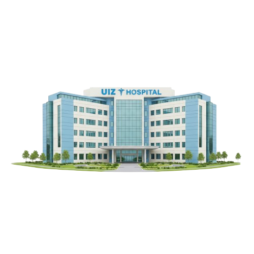

<div align="center">



# UIZ Hospital Appointment System 🏥

### Distributed Systems Module Project

**Professor:** Pr. EL HABOUZ Youssef  
**Major:** IISE (Ingénierie Informatique et Systèmes Embarqués)

<p>
  
  
  
  
</p>

</div>

---

## 📖 About The Project

**UIZ Hospital** is a robust web application designed to bridge the gap between patients and medical professionals. It enables patients to seamlessly book appointments while offering doctors a dedicated portal to manage their schedules and availability.

This project was developed as a practical implementation for the **Distributed Systems** academic module. Beyond standard web features, the core objective was to showcase a **hybrid architecture** that leverages both standard RESTful patterns and Remote Procedure Calls (RPC) to handle complex, distributed logic efficiently.

### ✨ Key Features

* **⚡ Hybrid Communication:** A unique architecture that integrates a **REST API (Express)** for general data operations and **RPC (Python)** for specialized computational logic.
* **🩺 Dual Portals:** Distinct, secure dashboards for **Patients** (Booking & History) and **Doctors** (Schedule Management).
* **🤖 AI Assistant:** Integrated **Botpress** chatbot providing 24/7 intelligent patient support and answering FAQs.
* **📩 Smart Forms:** Powered by **Formspree** for reliable, serverless email handling and notifications.
* **🔒 Enterprise-Grade Security:** Enhanced with Cloudflare CDN for DDoS protection and SSLZero for full encryption.

---

## 🛠️ Tech Stack & Architecture

This platform is built using the **MERN Stack** (MongoDB, Express.js, React, Node.js) extended with Python for RPC services.

### Core Framework
* **Frontend:** React.js (Single Page Application)
* **API Gateway:** Node.js & Express (Handles CRUD operations)
* **RPC Service:** Python (Executes specialized distributed logic)
* **Database:** MongoDB

### Integrations & Utilities
* **Botpress:** AI Chatbot integration for real-time user assistance.
* **Formspree:** Backend-less form submission and email notification service.
* **Netlify & Render:** Used for distributed deployment of Frontend and Backend services.

---

## 🔒 Security & Performance

We have prioritized security and performance to ensure a safe user experience:

* **Cloudflare CDN:** Accelerates content delivery globally and provides robust protection against DDoS attacks.
* **SSL/HTTPS:** Secured via **SSLZero**, ensuring all data transmission between the client and distributed nodes is encrypted.
* **SEO Optimization:** Verified with **Google Search Console** for improved visibility, utilizing a generated `sitemap.xml` and configured `robots.txt`.

---

## 👥 The Team

This project was brought to life by the collaborative efforts of our dedicated team from the **IISE** major:

* **Hamza Labbaalli**
* **Abdoulouahed Id-boubrik**
* **Yassine Maarouf**
* **Nada Bermil**
* **Soumaya Iddaha**

---

## 🚀 How to Run

### Option 1: Production Build (Frontend)
If you are running the optimized production build contained in this repository:

1.  **Prerequisites:** Ensure you have Node.js installed.
2.  **Install a static server:**
    ```bash
    npm install -g serve
    ```
3.  **Launch the application:**
    ```bash
    serve -s .
    ```
4.  Open your browser and navigate to `http://localhost:3000`.

### Option 2: Local Development (Source)
If you are working with the source code to modify the application:

1.  **Install Dependencies:**
    ```bash
    npm install
    ```
2.  **Start the Application:**
    ```bash
    npm start
    ```
    The application will launch in development mode.

---

<div align="center">
  <p>© 2025 UIZ Hospital Team. All Rights Reserved.<br/>
  <i>Built with ❤️ and Distributed Logic Cafe</i></p>
</div>
